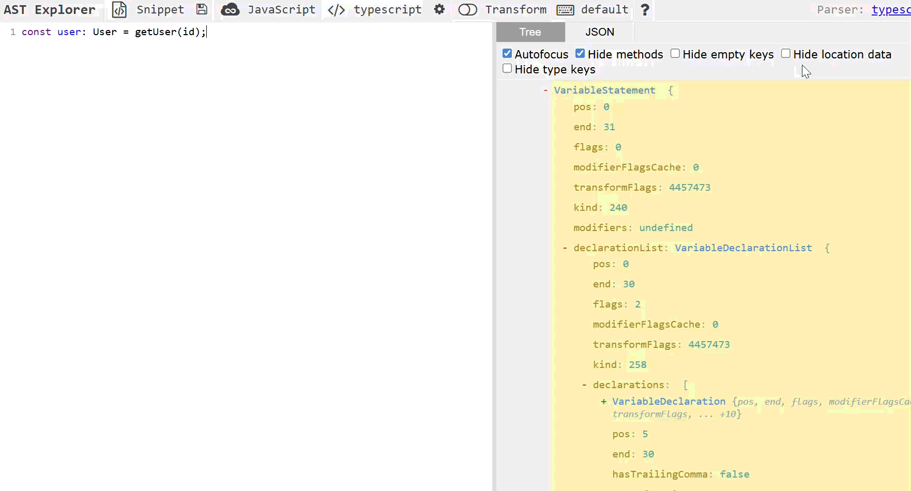

How TypeScript tools like Prettier and ESLint actually work is often abstracted away. A few VS Code configurations ensure codebases are seamlessly formatted and linted on every save. However, a surface-level understanding eventually becomes insufficient. Relying on black-box abstractions limits the ability to debug complex issues or build custom developer tools. Gaining complete control over these tools requires understanding the underlying logic, and it turns out, almost all of them share the exact same starting point.

### The structure: Abstract Syntax Trees

Code cannot be manipulated programmatically as plain text. Before a linter or formatter can evaluate source code, the human-readable string must be parsed into a machine-readable data structure. This transformation happens using ASTs.
Abstract Syntax Trees are the format that powers almost every tool in the TypeScript ecosystem. ESLint, Prettier, and the VS Code Language Server all start by converting your code into one.
Given a standard declaration like `const user: User = getUser(id);`, the parser doesn't read a sequence of characters. it constructs a hierarchical map. Each piece of the code becomes a node in a tree, with a specific role.
The following code:

```typescript
const user: User = getUser(id);
```

maps directly to this structural representation:

```
VariableStatement
└── VariableDeclaration
    ├── Identifier "user"
    ├── TypeReference "User"
    └── CallExpression
        ├── Identifier "getUser"
        └── Identifier "id"
```

This line of code is transformed and read as a tree of nodes. `A VariableStatement containing a VariableDeclaration containing a CallExpression`. Each node knows its kind, its position in the file, and its children. Written code is just a string, while the AST is the structure underneath it.

Tools like Prettier and ESLint can be thought of as `tree traversers` -

- `ESLint` - Traverses the tree looking for specific nodes (e.g., `"identify all VariableDeclaration nodes that violate camelCase naming conventions"`).

- `Prettier`: Traverses the tree to re-serialize it. It breaks the tree apart and reassembles it according to a set of style rules.

### Analyzing code: The TypeScript Compiler API

While ASTs provide the underlying data structure, reading, creating, and analyzing them requires a dedicated engine. This is the exact role of the TypeScript Compiler API. It's the programmatic toolbox that allows interaction and manipulation of the data structure. While the AST is the object, the Compiler API is the set of functions used to traverse, query, and modify that object.

A practical tool for this is the [TypeScript AST Viewer](https://ts-ast-viewer.com/). It maps out the exact AST for any valid TypeScript snippet you paste in, making it much easier to figure out how to target specific nodes when writing your own scripts.

For example, pasting in the previous code line immediately visualizes the tree structure discussed above, and interacting with it reveals the raw properties the compiler uses:


### Putting it into practice: TS-to-Go

For a recent project, I needed to automate the conversion of TypeScript interfaces into Go structs to keep data models in sync. Instead of manual duplication, I used the TypeScript Compiler API to:

- Parse the source TypeScript files into an AST.

- Walk the tree to find `InterfaceDeclaration` and `PropertySignature` nodes (indicating models).

- Map TypeScript types (`string`, `number`, `boolean`) to their Go equivalents.
  for example, mapping primitive TypeScript types to their Go equivalent -

```typescript
/** maps primitive typescript types to go types
 * @example MyType = string; // maps to string
 * MyType = number; // maps to float64
 * MyType = boolean; // maps to bool
 */
export function mapPrimitiveType(typeNode: ts.TypeNode): string | undefined {
	switch (typeNode.kind) {
		case ts.SyntaxKind.StringKeyword:
			return "string";
		case ts.SyntaxKind.NumberKeyword:
			return "float64";
		case ts.SyntaxKind.BooleanKeyword:
			return "bool";
	}
}
```

You can check out the full implementation of the transformer [here](https://github.com/annaadar/ts-to-go).

Working directly with the Compiler API makes it clear how tools like ESLint and Prettier actually operate. It serves as a reminder that complex tooling relies on predictable logic rather than magic. It is simply a matter of breaking down and understanding the underlying structures.

## Resources

- [Ts-to-Go on Github](https://github.com/annaadar/ts-to-go)
- ["Using the Compiler API" .md on the Typescript Repo](https://github.com/microsoft/TypeScript/wiki/Using-the-Compiler-API)
